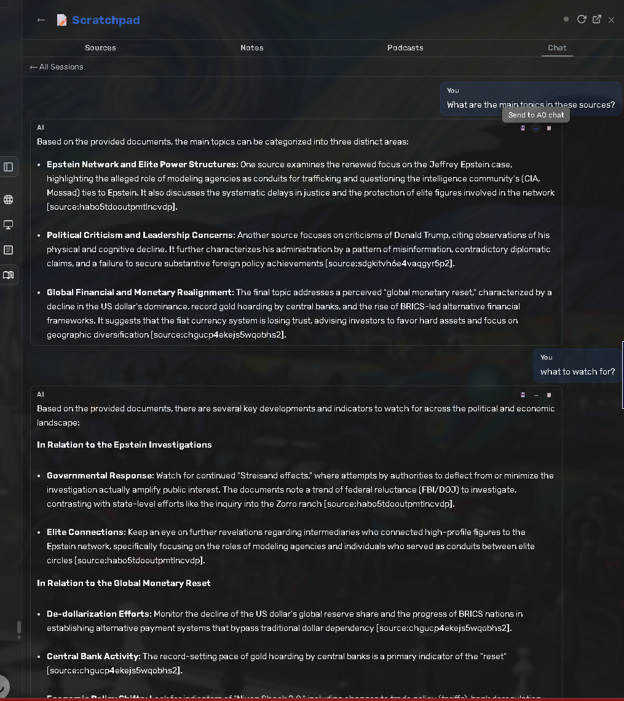
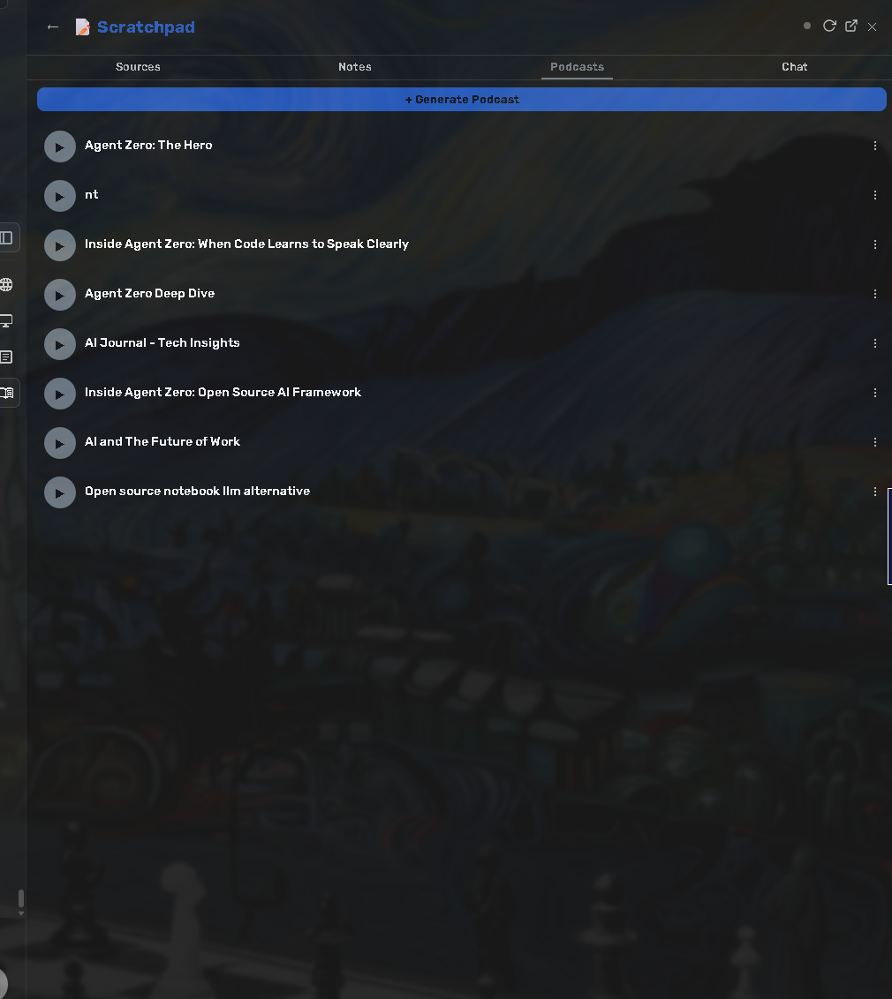
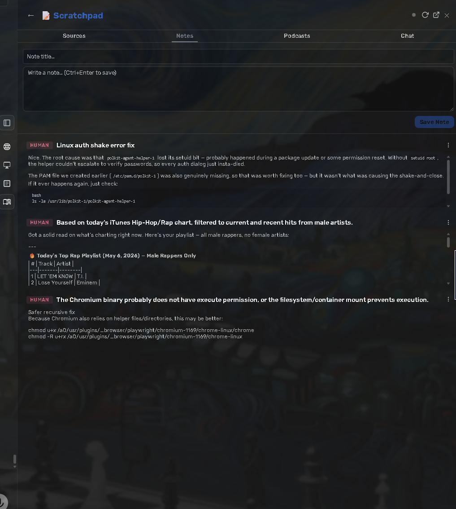
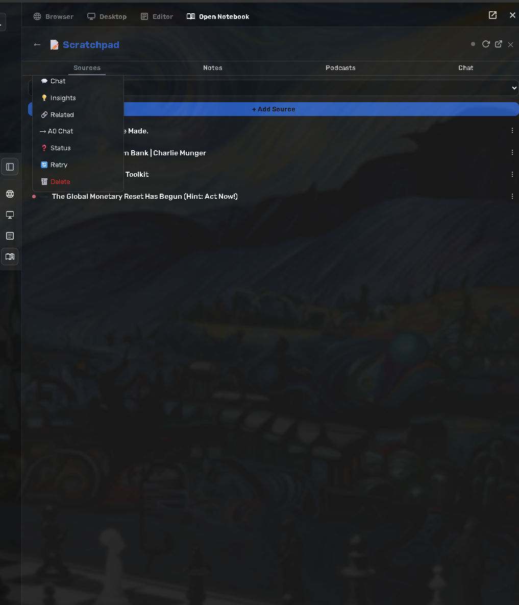

# Open Notebook Plugin for Agent Zero

[](LICENSE)
[](https://github.com/agent0ai/a0-plugins)

Connect your [Open Notebook](https://github.com/lfnovo/open-notebook) instance to [Agent Zero](https://github.com/agent0ai/agent-zero) for seamless knowledge management — browse notebooks, manage sources, query with RAG, create notes, generate podcasts, and interact through a right-canvas knowledge panel.

## Screenshots

### Chat & RAG Queries


### Podcast Generation


### Notes


### Source Management


## Features

- **Browse Notebooks** — Navigate your notebook tree, inspect notebooks and sources
- **Source Management** — Add URLs and text as sources, list, read, retry, and delete
- **RAG Queries** — Search with keyword/vector search, ask questions over notebook content
- **Notes** — Full CRUD: create, read, update, and delete notes in any notebook
- **Podcasts** — Generate, list, inspect, retry, and download podcast episodes from your notebooks
- **Knowledge Panel** — Interactive right-canvas panel in the Agent Zero WebUI
- **Configurable Connection** — Point to any Open Notebook host and port
- **Optional Tunneling** — Cloudflare quick tunnel support for remote browser access

## Prerequisites

- [Agent Zero](https://github.com/agent0ai/agent-zero) with plugin support
- A running [Open Notebook](https://github.com/lfnovo/open-notebook) backend instance
- Python 3.10+
- Optional: [`cloudflared`](https://developers.cloudflare.com/cloudflare-one/connections/connect-networks/downloads/) for tunnel-based remote access

## Installation

### From Plugin Hub (Recommended)

1. Open Agent Zero Settings → Plugins
2. Find **Open Notebook** in the Plugin Hub
3. Click **Install**
4. Configure the `api_url` setting to point to your Open Notebook instance

### Manual Installation

1. Clone or download this repository
2. Copy the `open_notebook/` directory to your Agent Zero user plugins folder:

```bash
cp -r open_notebook/ /path/to/agent-zero/usr/plugins/
```

3. Restart Agent Zero
4. Enable the plugin in Settings → Plugins

## Configuration

### Open Notebook URL

Set the `api_url` to point to your Open Notebook backend:

| Environment | Example |
|---|---|
| Docker (default) | `http://host.docker.internal:5055` |
| Custom port | `http://host.docker.internal:8080` |
| LAN IP | `http://192.168.1.100:5055` |
| Localhost | `http://localhost:5055` |

The URL is resolved in this order:

1. Plugin setting `api_url` (Agent Zero Settings UI)
2. Environment variable `OPEN_NOTEBOOK_API_URL`
3. Default: `http://host.docker.internal:5055`

All backend components (proxy, tunnel, health check, tools) respect this single setting.

### All Settings

| Setting | Default | Purpose |
|---|---|---|
| `api_url` | `http://host.docker.internal:5055` | Base URL for the Open Notebook API |
| `read_only` | `false` | Block write/delete operations when `true` |
| `confirmations` | `true` | Ask for confirmation before destructive operations |
| `default_ask_model` | *(empty)* | Optional default model for ask/RAG operations |

Settings can be configured in Agent Zero under Settings → External, or directly in `default_config.yaml`.

## Usage

Once installed and configured, the plugin provides six agent tools and three skills.

### Agent Tools

| Tool | Methods | Description |
|---|---|---|
| `opennotebook_browse` | `notebooks`, `notebook`, `source` | Navigate notebook trees and inspect content |
| `opennotebook_manage` | `status`, `config` | Check connection and view configuration |
| `opennotebook_sources` | `list`, `add`, `read`, `retry`, `delete` | Manage sources in your notebooks |
| `opennotebook_notes` | `list`, `create`, `read`, `update`, `delete` | Full note management |
| `opennotebook_query` | `search`, `ask`, `find` | Search and ask questions over notebook content |
| `opennotebook_podcasts` | `generate`, `status`, `list`, `download`, `retry`, `delete` | Generate and manage podcast episodes |

### Example Prompts

```
Browse my Open Notebook notebooks
```
```
Add https://example.com/article as a source to my Research notebook
```
```
Ask my Research notebook: What are the key findings from the user interviews?
```
```
Create a note in my Research notebook titled "Key Insight" with the following content: ...
```
```
Generate a podcast from my Research notebook
```

### Skills

The plugin includes three skills that guide the agent through common workflows:

| Skill | Description |
|---|---|
| `open-notebook` | Meta-skill: tool map, user journeys, and first-time setup guidance |
| `open-notebook-research` | Guided research and query workflow with search/ask/find decision tree |
| `open-notebook-podcast` | Async podcast generation workflow: profile discovery, generation, and monitoring |

## Architecture

### File Structure

```text
open_notebook/
├── plugin.yaml                  # Runtime manifest
├── default_config.yaml           # Default settings
├── config.py                     # Configuration helper
├── client.py                     # Open Notebook API client
├── execute.py                    # Setup/connectivity script
├── shared.py                     # Shared utilities
├── errors.py                     # Error types
├── telemetry.py                  # Telemetry module
├── requirements.txt              # Python dependencies
├── LICENSE                       # MIT license
├── README.md                     # This file
├── api/
│   ├── proxy.py                  # API proxy handler
│   └── tunnel.py                 # Tunnel management handler
├── extensions/
│   ├── python/
│   │   └── tool_execute_before/
│   │       └── _10_health_check.py
│   └── webui/
│       ├── page-head/            # CSS injection
│       ├── sidebar-end/          # Sidebar controls
│       ├── right_canvas_register_surfaces/  # Canvas registration
│       └── right-canvas-panels/  # Knowledge panel
├── prompts/default/              # Agent tool prompt templates
├── skills/                       # Guided workflow skills
│   ├── open-notebook/
│   ├── open-notebook-research/
│   └── open-notebook-podcast/
├── tools/                        # Agent tools
│   ├── opennotebook_browse.py
│   ├── opennotebook_manage.py
│   ├── opennotebook_notes.py
│   ├── opennotebook_podcasts.py
│   ├── opennotebook_query.py
│   ├── opennotebook_sources.py
│   └── shared.py
└── webui/                        # Frontend assets
    ├── canvas-panel.html
    ├── open-notebook.css
    └── open-notebook-store.js
```

### Runtime Routes

| Route | Purpose |
|---|---|
| `/plugins/open_notebook/*` | Static assets served to the browser |
| `/api/plugins/open_notebook/proxy` | Backend proxy to Open Notebook API |
| `/api/plugins/open_notebook/tunnel` | Tunnel management and status |

## Security

- **You control the backend.** This plugin connects to an Open Notebook instance you configure. No data is sent to third parties.
- **Tunnel awareness.** If you enable tunneling, the Cloudflare quick tunnel creates a publicly reachable URL. Only enable this when you intend to share access externally.
- **No secrets in code.** Do not commit API keys or tokens to this plugin. Use Agent Zero's settings UI or environment variables.
- **Read-only mode.** Set `read_only: true` to prevent all write and delete operations during exploratory use.
- **Confirmations.** Set `confirmations: true` (default) to require approval before destructive actions.

## Troubleshooting

| Issue | Solution |
|---|---|
| "Connection refused" | Verify your Open Notebook backend is running and `api_url` is correct |
| Tools not appearing | Restart Agent Zero to refresh tool registration cache |
| Tunnel not starting | Ensure `cloudflared` is installed and in your PATH |
| Sources timing out | Link sources may take 30–120s to process; increase your timeout settings |

## License

This project is licensed under the [MIT License](LICENSE).

## Links

- [Open Notebook](https://github.com/lfnovo/open-notebook) — The knowledge management system
- [Agent Zero](https://github.com/agent0ai/agent-zero) — The AI agent framework
- [Plugin Index](https://github.com/agent0ai/a0-plugins) — Browse more Agent Zero plugins
